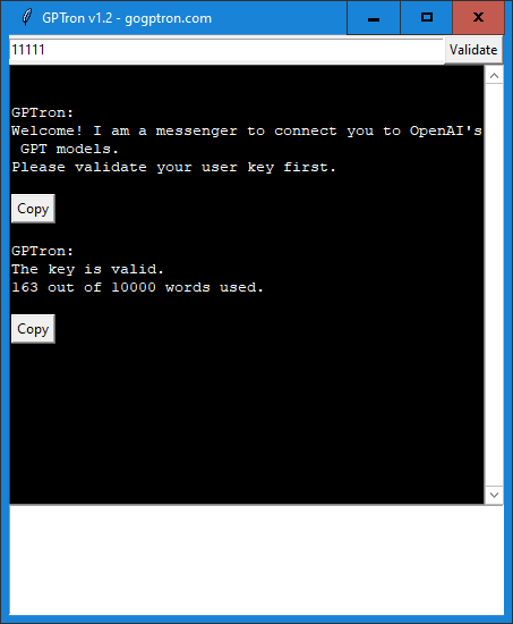

# GPTron
GPTron is a messenger of GPT models from OpenAI. It connects users to the language models using a API key provided by the users.

## Usage and free trial key
Simply double click the exe file in Windows OS. It will ask you to validate your user key. You can use the trial key 11111. You can get user keys from gogptron.com later.

## Virus warning
The exe file would be falsely detected as a virus by some virus scanners because it was compiled from a python script using pyinstaller, which is a common problem. Feel safe to whitelist it.

## Website
We are building a website for GPTron at gogptron.com. Please keep watching on it.
